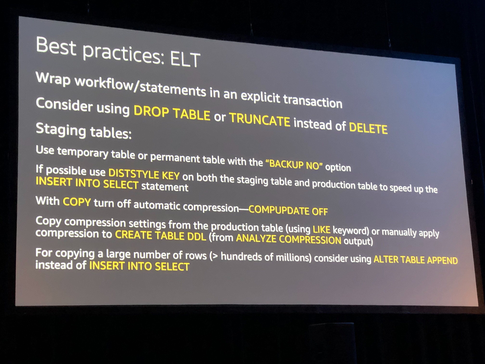

## ANT418 - Deep dive and best practices for Amazon Redshift

In this session, we take an in-depth look at best practices for data warehousing with Amazon Redshift. We show you the best way to analyze all your data, inside and outside your data warehouse, without moving the data, which helps you gain deeper insights for running your business. We also cover best practices for how to design optimal schemas, load data efficiently, and optimize your queries to deliver high throughput and performance.

### Redshit facts 
- Max out at 8.2 PB of storage
- Massive, parallel, shared
- nothing columnar architecture

- Leader node
    - SQL endpoint
    - Sotres metadata
    - Coordinates parallel SQL processing
- Compute Nodes
    - Local, columnar storage
    - Executes queries in parallel
    - Load, unload, backup, restore
- Amazon Redshuft Spectrum Nodes
    - Execute queries directly against S3

- Amazon redshift architecture evolving
    - Redshift managed storage
        - pay separately for storage and compute
        - Large high speed SSD backed cache
        - Automatic scaling
        - Supports up to 8.2PB of raw storage
    - AQUA (Advanced Query Accelerator) for Redshift
        - New distributed and hardware-accelerated processing layer
    - Node Types
        - DC2 - Dense compute, SSD
        - DS2 - Dense storage, Magnetic discs

- Terminology and concepts: Columnar
    - Amazon redshift uses a columnar architecture for storing data on disk
    - Goal: reduce IO for analytics queries
    - Improved performance
- Terminology: Compression
    - Allow you to store more data and reduce cost
    - Improve query performance through decreased I/O
    - Compression applied column by column
- AZ64 Encoding
    - proprietary compression encoding algo designed to achieve high compression ratio and improved query processing
    - Goal: increase compression ratio, reducing required footprint
    - Increase query performance by decreasing both encoding/decoding types
    - Use AZ64 for INT, SMALLINT, BIGINT, TIMESTAMP, TIMESTAMPTZ, DATE, NUMERIC
    - Use analyze compression comannd to find optimal compression
- Terminology: Blocks
    - Column data is presited to 1 MB immutable blocks
    - Block are individually compressed
- Terminology: Zone maps
    - Minimum and max values for blocks
    - Effectively allows to prune at query time
- Terminology: Data sorting
    - Make queries run faster by increasing the effectiveness of zone maps and reducing I/O
- Best Practices: Sort Key
    - Place the sort key on columns that are frequently filtered on placing the lowest cardinality columns first
    - With an established workload, use the following scripts to help find sort key suggestions
    - Between 1 and 3 sort columns
    - Less beneficial on smaller tables
- Terminology: Materialize Columns
    - Make queries run faster by leveraging zonemaps on the fact tables
    - Frequently filtered and unchanging dimension values should be materialized within fact tables
    - Often calculated values should be materialized within fact tables
- Terminology: Slices
    - A slice can be though of like a virtual compute node
    - Each compute node is initialized wiht either 2 or 16 slices
    - Table rows are distributed to slices
- Data distribution
    - distribution style is a table property which dictates how that tables data is distributed throughout the cluster
    - distribute data evenly for parallel processing
    - minimize data movement during query processing
    - KEY: value is hashed, same value goes to some location (slice)
    - ALL: Full table data goes to the first slice of every node
    - EVEN: round robin
    - AUTO: Starts as an ALL and moves to EVEN over time
    - DISTSTYLE KEY is typically used for joins, insert into select, and groupby
    - DISATSTYLE ALL is typically used for joins with dimensional and small tables (<3M rows)
- Terminology: Redundency
    - utilizes locally attached storage devices
    - global commit ensures all permanent tables have blocks written to multiple locations to ensure data redundancy
    - asynchronous backup happens every 5 GB or 8 hours, whichever comes first
- Terminology: Transactions
    - ACID-compliant
    - fully transactional
    - always will get isolation level serializable
    - Commits are expensive, this is a Data Warehouse. Limit commits by explicity creating transactions
- Data Ingestion: Copy statement
    - Ingestion throughput - each slice's query processors can load one file at a time
    - Break up file into many pieces so it can be parallelized
    - Have as many slices as nodes in cluster
    - Files in S3 should be between 1MB and 1GB after compression (GZip)
    - Keep files simple (delimited helps)
    - pick simple charater for null
- Data Ingestion: Amazon Redshift spectrum
    - Save cluster resources for querying and reporting rather than on ELT
- Data Considerations: Data ingestion
    - Batch processing system, optimized for processing massive amounts of data
    - 1 MB size plus immutable blocks means that we clone blocks on write so as not to introduce fragmentation
    - Small write (~1-10 rows) has similar cost to a larger write (~100K rows)
- Deduplication/UPSERT
    - Load CSV data into a staging table
    - Delete duplicate data from production table
    - Insert (or append) data from staging table
- Best Practices: ELT
    - 
- (AUTO) VACUUM
    - will remove rows that are marked as deleted
    - will globally sort tables
    - should only be run when necessary
    - DELETE will reclaim space and SORT will sort the needed portions of the table
- (AUTO) ANALYZE
    - process collects table statistics for optimal query planning
- Workload Management
    - Prioritize important queries
    - Throttle low priority queries
    - enable short query acceleration, will detect short running queries and run them within the short query queue if queuing occurrs
