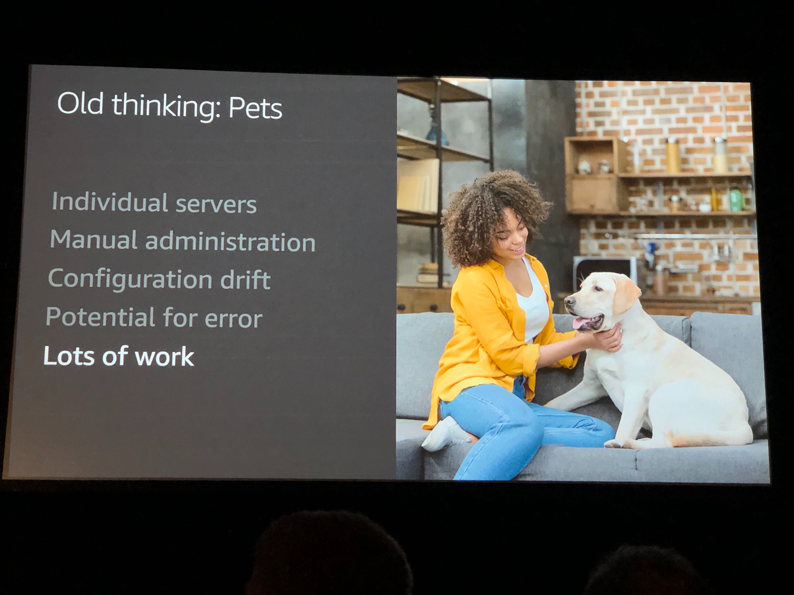
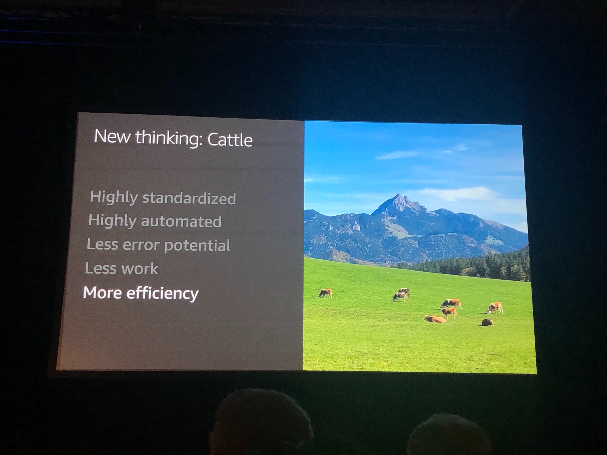
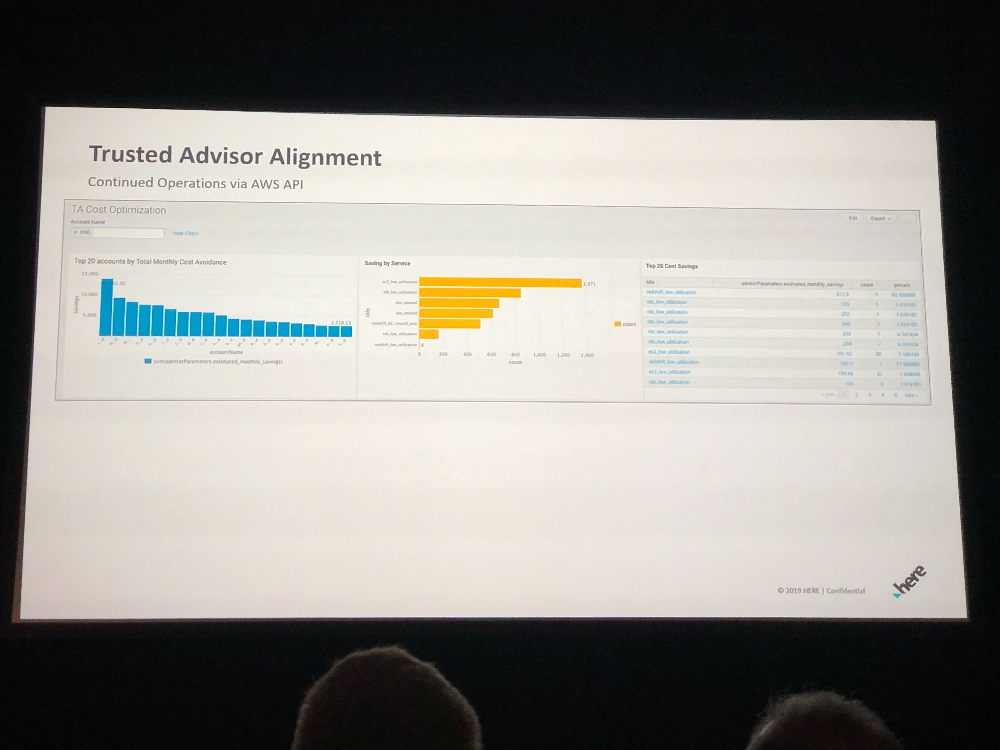
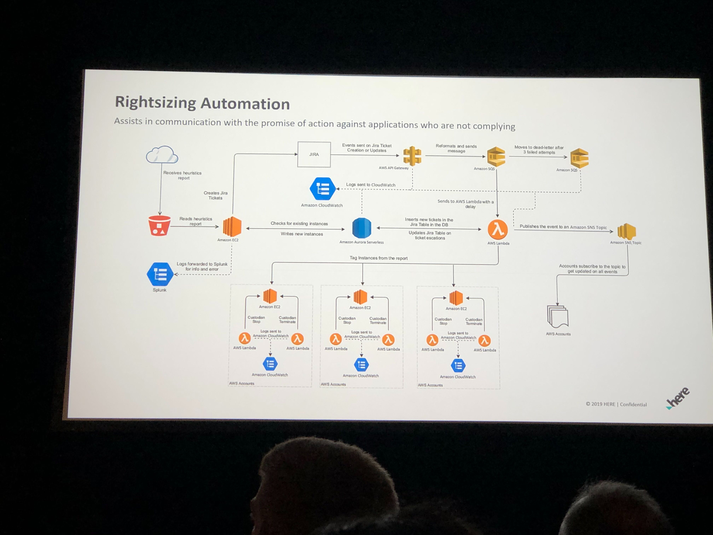
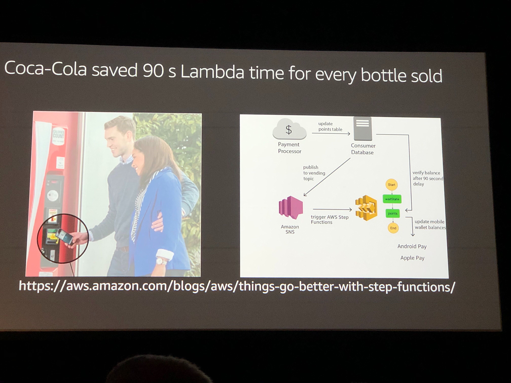
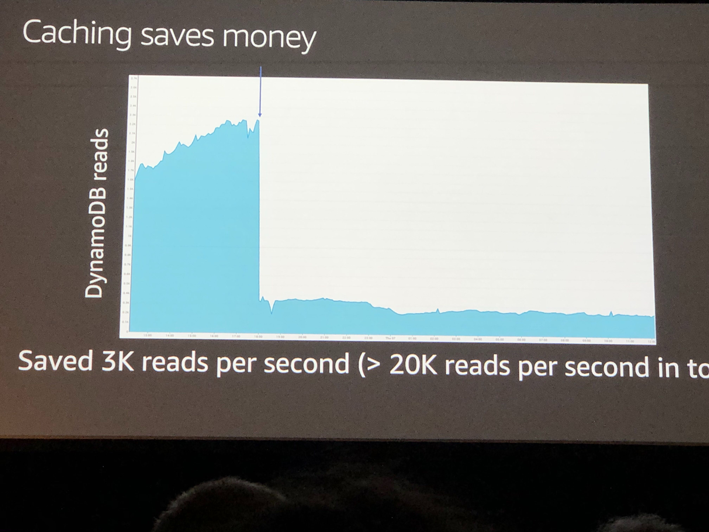

## ARC209-R1 - [REPEAT 1] Running lean architectures: How to be cost-effective on AWS

Everybody can save money on AWS by optimizing your architecture! This session reviews a wide range of cost-optimization strategies, featuring real-world examples. In addition to Reserved Instances, we have a special focus on Spot Instances to get a discount of up to 90 percent. We also talk about leveraging AWS Auto Scaling, caching and offloading content to Amazon CloudFront to reduce backend load, and much more. Running serverless? Learn how to cut costs on serverless through minimizing AWS Lambda execution time and maximizing networking throughput. Additionally, we cover optimizing training and inference costs for machine learning on AWS.

### AWS business model
- Flywheel
    - Reduce prices
    - More customers
    - More AWS usage
    - More infrastructure
    - Economies of scale
    - Lower infrastructure costs
    - Repeat

AWS is for builders
- Architectural flexibility is biggest strength
- Main goal is to avoid unnecessary stuff
- OK to start with minimum viable architecture, but then need to get rid of unnecessary resources and inefficiencies

- Cost optimization flywheel
    - Measure
    - Architect
    - Build
    - Repeat

- Old Model: "Pets"
    - 
- New Model: "Cattle"
    - 

### Measure
- AWS billing and cost management dashboard
    - complete picture of all of your costs in every dimension, as well as budgeting feature
    - Cost explorer now as an API that can be integrated with monitoring systems
- Use EC2 reserved instances
    - get discounted hourly rate
    - Optional capacity reservation
    - Available in one and three year terms
    - Save up to 75% compared to on-demand
    - Three types
        - Standard
        - Convertable
        - flexible

## Architecture best practices on how to lower your AWS bill
- Turn off unused instances
    - developer, test, and training instances
- Use instance start and stop
- Turn on/off whole architecture setups
- Think: disposable instances
- Automation
    - EC2 Autoscaling
        - Start new instances to increase capacity
        - Terminate instances to reduce capacity
        - Wins
            - Automactic capacity management
            - Automatic mitigation against failures
- Spot instances
    - Can save up to 90% by using spare capacity
    - Can be interrupted with two minutes notices
    - Supported by EC2 autoscaling
    - Spot instances are simple, easy, and predictable
    - Easy to manage through spotfleet
    - Or EC2 autoscaling

### Real-world customer examples
HERE Technologies

#### Challenges facing traditional RI Purchasing Strategy
- Large environment
    - 500 accounts operating independently
    - over 10 million unique EC2 instances
- Team autonomy
    - Varied instance family usage
    - Initially only 10% overall reservation coverage
- Limited Reporting

#### New Approach - Proposal to Centralize
- Finance engagement
    - Centralize purchasing of reservations to single cost center
    - Structure cross-charge methodology
- Management Buy-In
    - Look at reservations at the fleet level
    - Institute KPIs
    - Track costs/savings via project
- Add Technology
    - Include robust reporting capability
    - Vacancy needs analysis and mitigation
        - Python script used as Vacancy Solver (Replaced by Cloudability)

#### Time for action
- Fleetwide analysis
    - Incorporated Green Zone / Red Zone Approach
        - Green Zone: > X% Instance family usage in prime regions
        - Red Zone: Lowest reuse families and regions (Not Green)
    - Created Matrix
- Implement Control
    - Lock out individual team purchase capabilities (AWS Organization policy)
    - Redirect one-time costs to Central Program cost center
    - Set up bulk monthly purchase
- Trusted Advisor Alignment
    - Continued Operations via AWS API
    - Daily polling of API to our dashboard
        - Dashboard
    - Weekly reports to teams group email
    - Action via PMs and Roadmap is managed by the Custodian to ensure compliance
    - 
- Personal Health Dashboards
    - Teams get alerted when issues hit R&D accounts
        - We do not have NOC monitoring on R&D accounts

#### Results
- RI Coverage
    - Greater than 80% coverage in yearh 1
    - Teams became cost aware
- Expansion
    - Moved away from central program
- Savings
    - In 3 years, $50M Saved, $150 Cost Avoided

#### Lessons learned
- Spread monthly purchases evenly
    - Allows for beter course correction
- Resist exceptions
    - Unneeded complexity
- Program design decisions
    - Bleded price ramifications
    - Bank / Distribute
    - Supplement Cost Programs
- FinOps is the goal
    - Program will evolve

### AWS Savings Plans
- A new flexible prising model
- Save up to 72% on EC2 and Fargate
- Commit to a consistent usage (e.g. $10/hour) over 1 to 3 years
- Receive lower price in exchange
    - Easy to use
    - Good savings
    - Very Flexible
- 2 Types
    - Compute Savings
        - Flexible across family, region/AZ, OS, tenancy, EC2 or Fargate
        - Greatest Flexibility
    - Intance Savings Plan
        - Flexible across size, AZ, OS, and Tenancy
        - Lowest Prices
- AWS cost explorer will help

### Serverless Computing saving strategies
- Never pay for idle time
- But must avoid wait cycles within lambda to be efficient
- Use non-blocking code instead
- Group initiating calls in beginning through multi-threading
- Stategies
    - Event driven code
    - Multi-Threading
- Avoid sleeping inside your functions
    - Use AWS step functions instead, waiting inside step functions is free
    - Use Case: Coca Cola 
- Caching
    - Do expensive stuff once, reuse as many times as possible
    - Cache everywhere
    - Simplest way is Amazon CloudFront (CDN)
        - Can scale down backend
    - Use Case: 

### Build efficiently
- Avoid unnecesary heavy lifting
    - Leverage existing services
        - Use AWS database services
        - Use AWS application integration services
        - Use AWS analytics services
        - Don't reinvent the wheel

### Saving on AI/ML (SageMaker)
- Turn off unused instances
    - Amazon Sagemaker notebooks
- Automate everything
- Use auto scaling
- Use spot instances
- Avoid unnecessary heavy lifting
    - Use Amazon SageMaker
- Build
    - Use AWS managed services for data preparation
    - Use SageMaker ground truth for labeling
    - Experiment on your local machine to save cost
    - Automate notebook start/stop
    - Rightsize your notebooks
        - They're elastic, so start small and then scale up
- Save on ML Model Training
    - Rightsize: start with smalles, scale out first, then scale up
    - Configure your jobs to use checkpoints for managed spot training
    - Use AWS provided TensorFlow and MXNet, they're optimized for platform
    - Use TFRecord or RecordIO for optimized IO
    - Stream large datasets using Pipe mode for higher efficiency
    - Use SageMaker automatic model tuning
- Saving on inference/ML in production
    - biggest cost driver of ML is inference
    - Use SageMaker Neo to create optimized executables
    - Use batch transform instead of real-time predictions if possible
    - Delete unnecessary endpoints
    - Use inference pipelines and multi-model endpoints instead of separate endpoings
    - Rightsize inference instance types
    - Use eslastic inference for up to 75% lower costs
    - USe auto scaling: scale out first, then scale up

### Summary
- Use EC2 spot instances, RIs, and savings plans
- Turn off unused instances
- Automate: Use Amazon EC2 auto scaling and more
- Serverless; Avoid synchronous patterns and wait cycles
- Cache everythings, everywhere. Caches pay for themselves
- Leverage managed services
- AI/ML: Use amazon sagemaker advanced features
