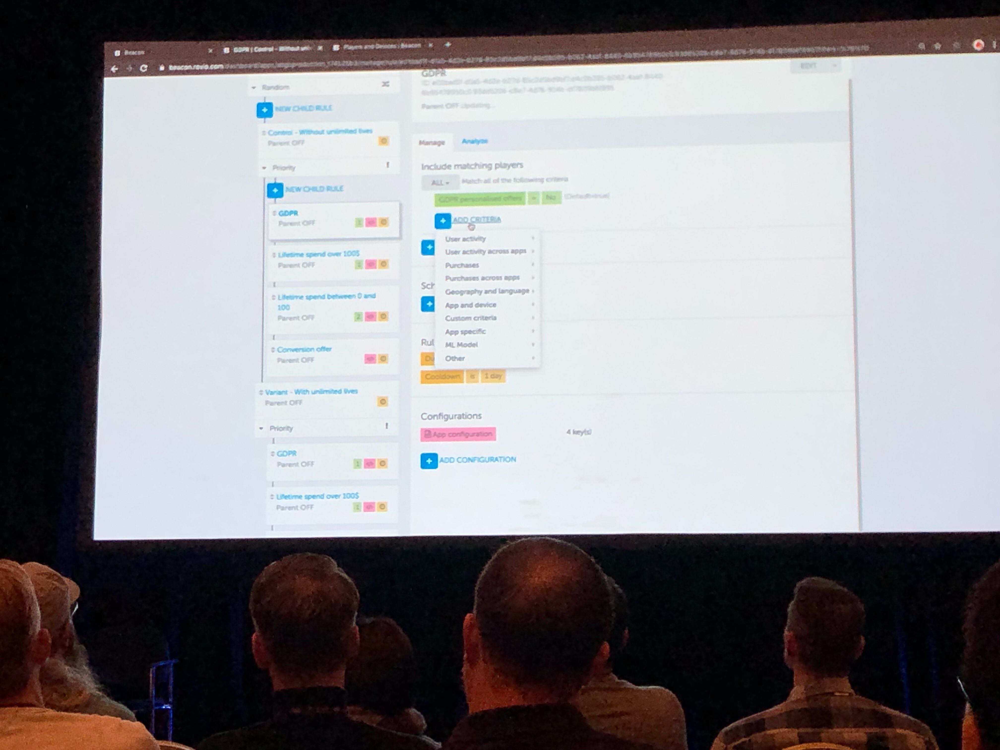

[Talk List](./README.md)
# GAM301 - How Rovio teaches Angry Birds to fly in the cloud using ML

On Angry Birds’s tenth birthday, join Rovio Entertainment to learn how one of the world’s most recognizable game franchises came to life with the help of AWS Cloud services and continues to entertain millions of gamers using machine learning. In this session, David Mason (SVP of technology) and Asko Relas (senior data engineer) show how Rovio supports millions of players worldwide and serves thousands of requests per second. Discover how, with four billion analytic events captured per day, Rovio uses machine learning to predict and deliver the perfect level of fun for players.

## Beacon: Our cloud services
- realized need for infrastructure to manage payments and identity, as well as promotions and analytics
- Today: 
    - `> 1B player accounts`
    - `> 10k requets per second`
    - `> 2Bn Analytic events per day`
    - `> 1300 EC2 instances`
- Product-ized operational tools for game teams
- Beacon - A tool for all business operations, analytics, reporting, etc.
- A/B test UI
    - 
- Liveops Calendar
    - 
- Churn score is calculated in user profile and for analytics
- Analytics pipeline
    - 
- Game server infrastructure is built with reusable templates
- Game server microservices
    - 

## Our machine learning (ML) story
- ML/AI in gaming
    - 
- Goal is to build games for the individual player
    - 2011: Data collection starts
    - 2014: Churn and conversion prediction
    - 2016: Using churn prediction to improve level funnel
    - 2018: LTV prediction in profiles, user specific app install propensity prediction for cross-promoton, anomoly detection

## Use case: reinforcement learning for level difficulty prediction
- Project overview
    - Designing the level funnel of a puzzle game is a balancing act
    - Prediction (automation) allows cutting down time on manual play testing
- Concept
    - Level designer submits pack for evaluation
    - Bot plays the levels and records statistics of them
    - Predict pass rates of real players from bot statistics
- Solution architecture
    - 
    - API for bot execution (Lambda)
    - Levels in S3
    - Prediction saved to RDS
- Different bot approaches
    - Hueristic: Store every available action based on predefined rules, simple to implement, but one policy for the whole game.
    - Tree search: Build a tree of game states and find best actions (optimal path), no understanding of game mechanics, but slow and computationally heavy
    - Imitation learning: Collect data on how people play the game, train a bot to imitate it. Possibly the most human like but only one policy and more game instrumentation needed
    - Reinforcement learning: The bot learns how to play the game through experimentation, can learn a different policy for each level. It is slower than imitation, but faster than tree search
- Reinforcement learning cycle
    - Agent -> Action -> Environment -> Reward -> (repeat)
    - Approach is an adaptation of the deep q-learning algorithm
        - Feature engineered game state instead of raw graphics
        - Feed-forward neural net instead of a deep convolutional net
        - Dueling double q-learning with prioritized experience replay
- Data collection
    - Go through each level
        - 3000 training rounds
        - 1000 testing rounds
            - Calculate Pass rate, goals cleared, moves left, and extra moves needed
    - Collecting the dataset takes time
        - For the most accurate statistics, the bot first learns a level, then plays it
        - One game round takes 5-10 seconds even with sped up physics
        - Collecting the data set by playing the leves sequentially would take over a year
    - Solution
        - Bundle the game binary and bot source code to docker container
        - Run one container per level using AWS Batch
            - Data collection takes 2 days for any number of levels
        - Learn from multiple parallel instances of the game within one container
            - Data collection time down to 4 hours for any number of levels
- Parallelized RL
    - 
    - Statistics collected from Bot
    - scikit-learn as ML toolkit
    - Best prediction accuracy with XGBoost
        - Tree-based algorithms can't extrapolate
            - Additional classification between impossible/passable leves is necessary
    - Mean absolute error of 0.15
- Balance of Churn, Difficulty, and Revenue
    - If difficulty can be predicted, can churn and revenue be predicted?
        - Churn vs. Pass Rate
            - 
            - 
        - Revenue vs. Pass Rate
            - - 
- Summary
    - AWS Batch is great for parallel workloads, such as having bots play 1000 levels concurrently
    - Parallelization is key to implementing fast enough RL for business use
    - Next Step: Procedural content generation?

## Takeaways
- Put the player at the center
- Analytics is foundational
- Have vision, experiment, learn, productize
- ML will change the game