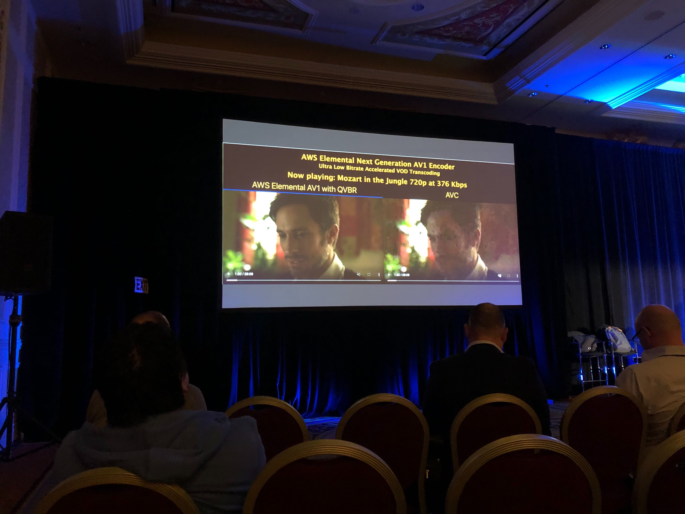
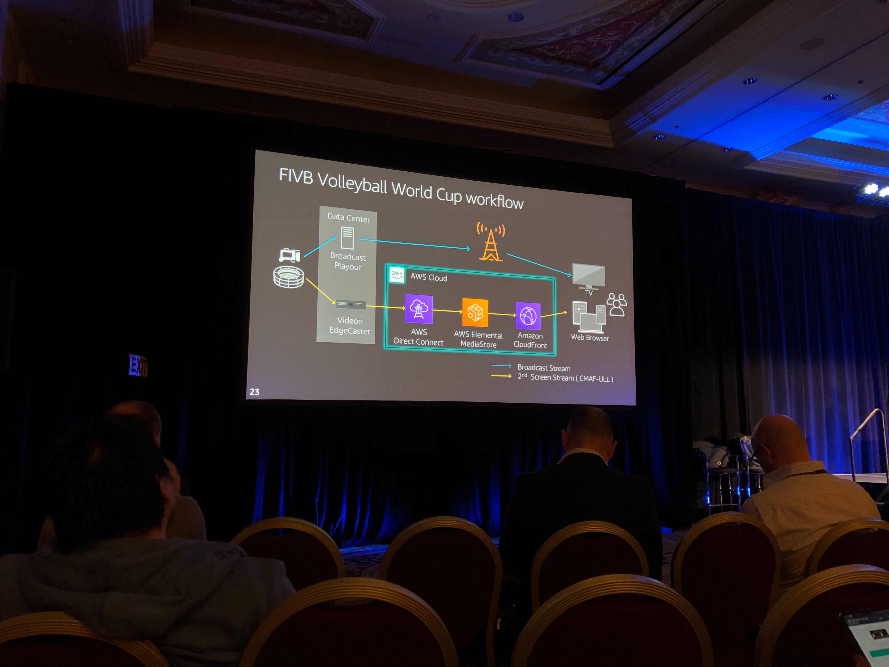
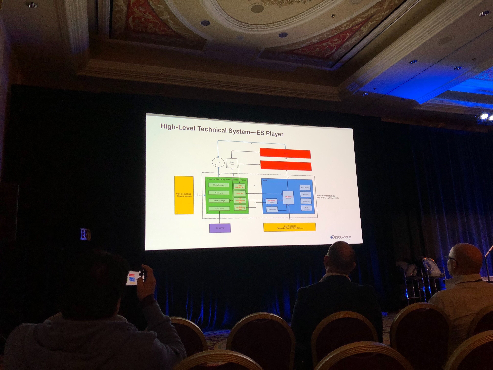
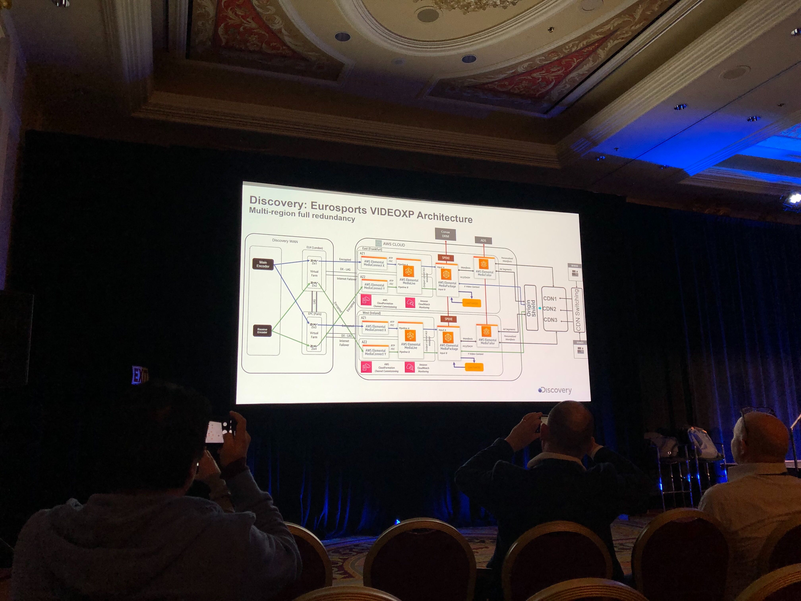
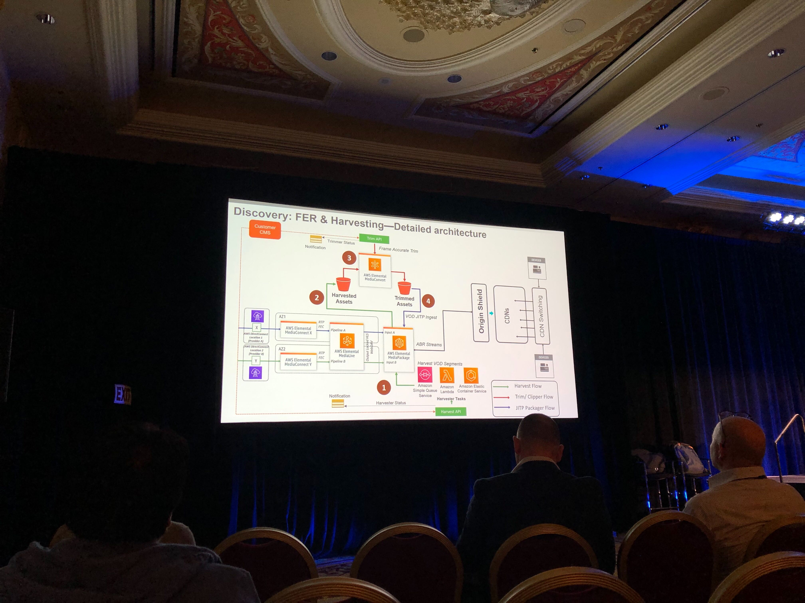
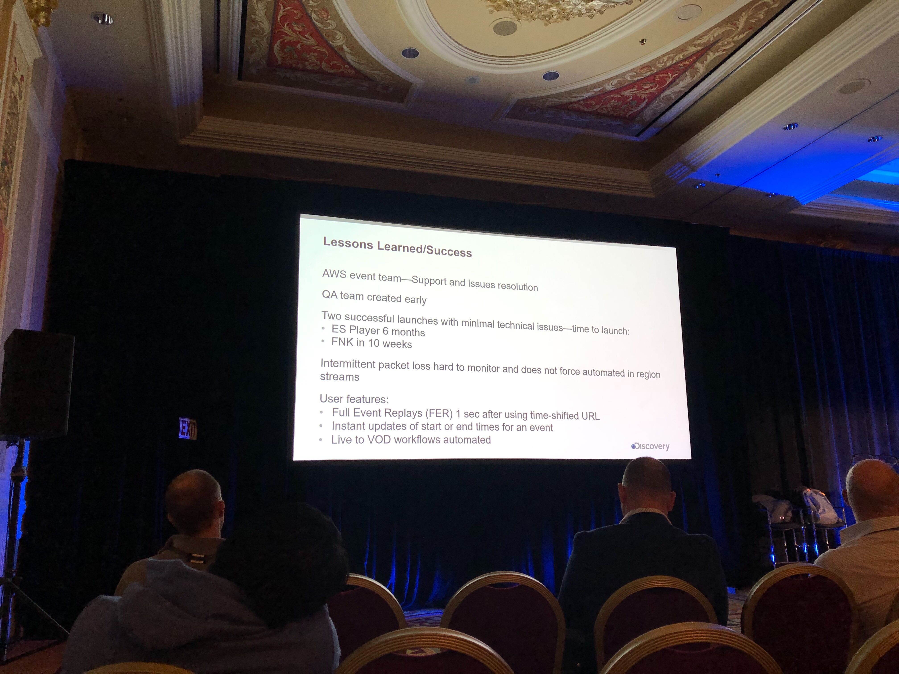

[Talk List](./README.md)
# MDS202-R - [REPEAT] Optimizing live video feeds to the cloud and the consumer

Viewers want more content on more devices, with top quality and low, broadcast-like latency allowing them to enjoy the action without delay. They also demand features such as enhanced graphics and real-time stats that go beyond traditional TV offerings. Learn how Discovery delivers live cooking classes with America’s favorite chefs on its Food Network Kitchen platform, and multi-language/multi-market sports on its Eurosport platform. This talk explores how today’s top content providers like Discovery are serving audiences with media solutions, machine learning, and core services from AWS.

## What does success look like?
- 0 to minimal buffering
- uninterrupted experience
- low latency: live sports
- scale
    - concurrent viewers
    - concurrent channels
    - both

Elemental MediaConnect
- robust and flexible video transport to, within, and from AWS

Media live
- 2 transcoders in 2 different AZs
- Output locking
    - each encoder creates segmented video

Elemental MediaPackage
- package origination service
- redundant inputs with single packaged Output
- Q Variable Bit Rate
- 

Cloudfront CDN

Use Case: Thursday Night Football
- Just in time transcoding for Ads
- 3 seconds glass to glass latency

Use Case: FIVB Vollyball World Cup 

Chunk CMath
- predictive segment downloads while write to S3 is still occurring

## Discovery Engineering
Created an in-house digital video processing pipeline, integrated with our braocast workflows to delivery all metadata/video/media to customers

- Metadata aggregator to single DB
- Advanced Erasure Coding Techniques to reliabily ingest data into the Cloud
- AWS MediaConnect - Multiple sources to single stream
- AWS MediaLive & Package
- Event based DRM
- Live Event Manager and event channel management
- Origin shield and mulitple CDNs with switching

ES (EuroSport) Player
- Tech Overview: 
- Architecture: 
- Arch. continued: 

Successes and Lessions Learned:

