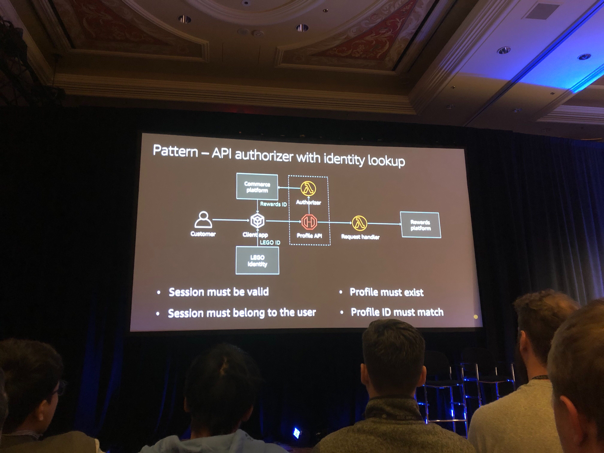

## SVS320-R - [REPEAT] The serverless journey of shop.LEGO.com

Connecting the LEGO play experience with millions of people requires an innovative platform. This has fueled the cloud migration of the legacy e-commerce application. In this session, we walk you through the principles, the approach, the learnings, and of course the serverless technologies that made the vision a reality. We cover multiple real-world use cases such as the integration of the e-commerce platform with the tax system, and the implementation of an event-streaming platform.

### How it all started
- Monolith
- Oracle ATG, SAP, and Tax Platform
- Then Elastic Beantalk container with Node.js + React
- Then added VPC gateway
- Black Friday 2017 - System went down
    - Slowness in Tax system led to many queued requests, leading to 503s for a couple of hours.
- SaaS tax system was introduced, utilizing API gateway as interface with Lambda 
- Black Friday 2018 - no issues

### A journey through patterns
- Atomic request-response API
    - 
    - Use Case: Add item to shopping basket
- Command Query Responsibility Segregation (CQRS) with status cache
    - 
    - Use Case: Status polling for long-running processes
- Email notification with signed URL
    - 
    - Use Case: Voucher codes generation and notification
- API authorizer with identity lookup
    - 
    - Use Case: User identity lookup in different systems (legacy, merger, etc.)
- Publish-subscribe sync
    - 
    - Use Case: On-demand customer data migration
        - 
- Event-driven data pipeline with buffering
    - 
    - Use Case: Product catalog import and update
    - Works for multiple object types
        - - 
- Codeless data ingestion
    - 
    - Use Case: API-driven data ingestion
- Codeless sequence generator
    - 
    - Use Case: Unique order ID generation
    - DynamoDB Atomic Counter
        - 
- URL redirects cached by CDN
    - 
    - Use Case: Website migration with URL changes
- Scheduled workflow
    - 
    - Use Case: Keeping website sitemaps updated
- Hub and spoke event bus
    - 
    - - 
    - Use Case: Checkout event processing
        - 

### Takeaways
- Look for something simple to begin with
- Implement automated integration tests
    - Don't spend time mocking AWS amazon services
    - Separate dev, test, and prod accounts
- Architect in "set pieces"
- No throwaway PoCs
- Leverage patterns